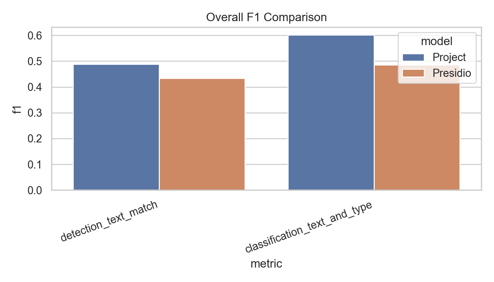
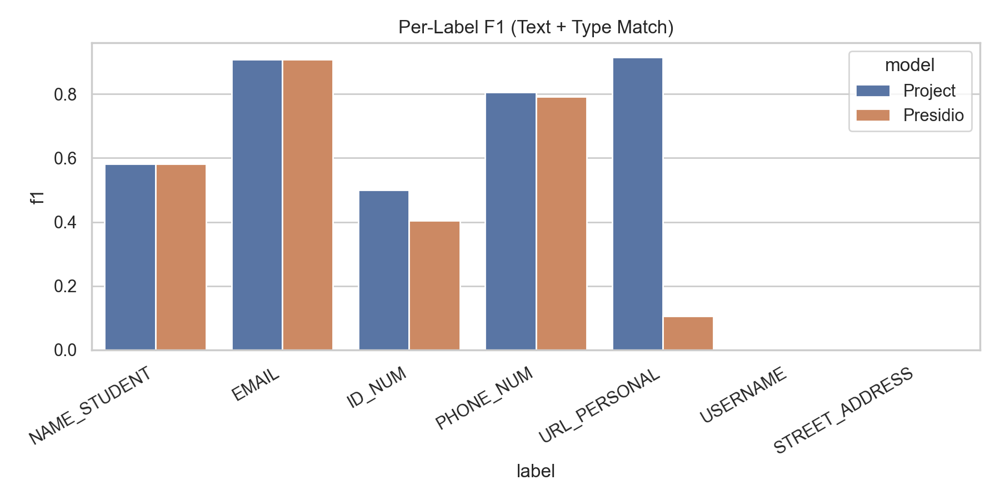
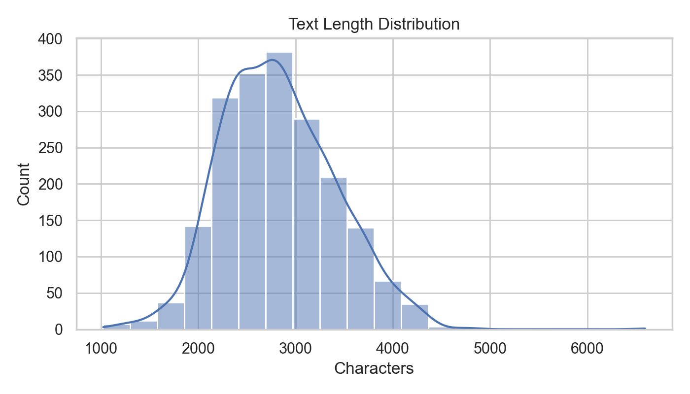

# PII Detection & Classification ML Report Project (Ultra‑Detailed)

This folder is a **report‑ready ML evaluation project** written in plain language. It compares your **project’s PII detector** with a **standard baseline model** and produces **tables + charts** for your final report.

The whole idea is like checking two students against an answer key:
- The dataset includes **correct answers** about which pieces of text are personal information.
- Each model tries to find those pieces of text.
- We measure how close each model gets to the answer key.

If a non‑technical person reads the report, they should understand:
- What was compared
- How “correctness” was defined
- What each number in the tables means
- What each chart is showing and why it matters

## What This Project Compares (Plain Language, Expanded)

- **Model A (Your Project):** The `PIIAnonymizer` built in this repo.
- **Model B (Baseline):** A standard tool called Presidio.
- **Task 1: Detection**  
  Can the model **find** personal information in the text?
- **Task 2: Classification**  
  Can the model say **what type** of information it is? (email, phone, ID, etc.)
- **Correct Answers (Gold Data):**  
  The dataset already includes the correct answers. These are the “ground truth” labels.

### Example in Simple Words

Text:  
`"Contact me at john@gmail.com or +1‑555‑123‑4567."`

Correct answers (from the dataset):
- `john@gmail.com` → EMAIL  
- `+1‑555‑123‑4567` → PHONE_NUM

The model is correct if it:
1. Finds the same pieces of text.
2. Labels them with the correct type.

## Dataset Format (Very Detailed)

The CSV has **two columns**:
- Column `0` = the text paragraph  
- Column `1` = the correct answers as a dictionary  

Example:
```
{
  'EMAIL': ['abc@x.com'],
  'PHONE_NUM': ['+1-222-333-4444']
}
```

This means the correct answers (gold data) are:
- `abc@x.com` is an EMAIL  
- `+1-222-333-4444` is a PHONE number

### Why the Dictionary Format Matters

The label dictionary works like an answer key:
- Each key is a **PII type** (EMAIL, PHONE_NUM, ID_NUM, etc.)
- Each value is a **list** of the actual text fragments that appear in the paragraph

So the evaluation is possible because the dataset already tells us:
- Exactly what text should be found
- Exactly how it should be classified

## Notebook: Cell‑by‑Cell (Ultra‑Detailed, Layman Friendly)

Open `ml_report_project/PII_Report.ipynb` and run **top‑to‑bottom**.

1. **Install dependencies**  
   Installs the tools needed for detection, evaluation, and plotting.
   - `presidio-analyzer`: baseline PII detector  
   - `spacy`: language model used inside your project  
   - `pandas`: handles tables  
   - `matplotlib` / `seaborn`: charts  
   - `tabulate`: formats tables
2. **Imports + theme**  
   Loads libraries and makes the charts look clean.
3. **Paths**  
   Points the notebook to the dataset and output folders.
   - Ensures `outputs/` and `outputs/plots/` exist.
4. **Load data**  
   Reads the CSV and shows the first few rows.
5. **Helper functions**  
   These small helpers do the heavy lifting:
   - **Text normalization**: removes extra spaces and cases so matching is fair.
   - **Gold label parsing**: converts the dictionary string into usable data.
   - **Mapping labels**: aligns each model’s label names to the dataset’s label names.
6. **Load your model**  
   Imports your project’s PII detector.
   - This is `PIIAnonymizer.detect_pii()` from your codebase.
7. **Load baseline model**  
   Imports Presidio (the standard baseline).
8. **Run the comparison**  
   This is the main evaluation loop. For **each row in the dataset**:
   - Reads the paragraph text  
   - Reads the correct answers (gold data)  
   - Gets predictions from both models  
   - Compares predictions to the correct answers  
   - Counts matches and mistakes  
   - Stores small error samples for the report
9. **Summary table**  
   Shows overall performance:
   - Precision (how many found items were correct)  
   - Recall (how many correct items were found)  
   - F1 (overall balance of precision + recall)
10. **Per‑label table**  
    Shows performance **for each PII type**:
    - Example: EMAIL accuracy vs PHONE_NUM accuracy  
    - Useful to identify strengths and weaknesses
11. **Type counts table**  
    Compares how often each label appears:
    - In the dataset (correct answers)  
    - In your model predictions  
    - In baseline predictions
12. **Save tables**  
    Exports the tables for your report.
13. **Charts**  
    Creates visual charts so the report is more convincing:
    - Overall F1 comparison  
    - Per‑label F1 comparison  
    - Label support (gold vs predicted counts)  
    - Text length distribution  
    - Entities per text distribution
14. **Macro‑average + dataset stats**  
    Adds dataset‑level information:
    - Average text length  
    - Average number of PII items per text  
    - Macro‑average (balanced across labels)
15. **Error samples**  
    Saves short examples of mistakes:
    - False positives (model guessed something that isn’t correct)  
    - False negatives (model missed a correct answer)

## Outputs (Report‑Ready, What Each File Means)

All outputs are saved under `ml_report_project/outputs/`:

- `summary_metrics.csv`  
  Overall detection + classification scores for each model.
- `per_label_metrics.csv`  
  Per‑label precision/recall/F1 (EMAIL, PHONE_NUM, etc.).
- `macro_metrics.csv`  
  Macro‑averaged scores (treats all labels equally).
- `dataset_stats.csv`  
  Simple dataset statistics (rows, text length, avg PII count).
- `type_counts.csv`  
  How many of each label appear in gold vs predictions.
- `sample_predictions.csv`  
  A few rows showing predictions and gold labels side‑by‑side.
- `project_error_samples.csv`  
  Example mistakes made by your model.
- `presidio_error_samples.csv`  
  Example mistakes made by the baseline.
- `analysis.md`  
  A markdown report summary that can be copied into your report.

Plots are saved under `ml_report_project/outputs/plots/`:
- `overall_f1.png` → overall model comparison
- `per_label_f1.png` → per‑label model comparison
- `label_support.png` → gold vs predicted label counts
- `text_length_distribution.png` → text size distribution
- `entities_per_text.png` → how many PII items per text

## How the Scoring Works (Plain Language, With Examples)

We use the same simple logic that teachers use when grading:

- **True Positive (TP)** = model found something and it was correct  
- **False Positive (FP)** = model found something but it was **not** in the correct answers  
- **False Negative (FN)** = model **missed** something that should have been found  

### Example

Correct answers in a text:
- EMAIL: `abc@x.com`
- PHONE_NUM: `+1-555-111-2222`

Model predictions:
- `abc@x.com` (EMAIL) ✅  
- `+1-555-999-8888` (PHONE_NUM) ❌  

Counts:
- TP = 1 (email was correct)  
- FP = 1 (wrong phone)  
- FN = 1 (missed the correct phone)

From these counts, we compute:
- **Precision** = how many predictions were correct  
  `TP / (TP + FP)`
- **Recall** = how many correct answers were found  
  `TP / (TP + FN)`
- **F1 Score** = balanced average of precision + recall  

These three numbers are standard in ML and easy to justify in a report.

## Detection vs Classification (Why We Measure Both)

### Detection
Detection means:  
**Did the model find the exact same piece of text that the dataset says is PII?**

If the dataset says `abc@x.com` is an email, detection checks:
- Did the model find `abc@x.com` at all?

### Classification
Classification adds a second check:
- Did the model also label it correctly?  
  (EMAIL, PHONE_NUM, ID_NUM, etc.)

So classification is **harder** and usually scores lower than detection.

## How to Read the Tables (Simple Guidance)

- **Summary metrics**: a quick overall comparison of both models.
- **Per‑label metrics**: shows which PII types are easiest or hardest.
- **Macro metrics**: treat all labels equally, so rare labels still matter.
- **Type counts**: shows if a model over‑detects or under‑detects certain types.

## How to Read the Charts (Simple Guidance)

- **Overall F1 chart**  
  A quick “who is better overall” view.
- **Per‑label F1 chart**  
  Shows strengths and weaknesses by PII type.
- **Label support chart**  
  Shows if the model predicts too many or too few of a label.
- **Text length distribution**  
  Shows if the dataset is mostly short or long texts.
- **Entities per text**  
  Shows how many PII items appear in each paragraph on average.

## Assumptions and Limitations (Important for Report)

- Matching is **exact text match** after cleaning spaces/lowercase.
- If a model finds a correct entity but with **slightly different text**, it may count as wrong.
- The label mapping aligns model labels to dataset labels, but it is not perfect.
- Results depend on the quality of the dataset labels.

## How to Run (Notebook)

Open and run:
- `ml_report_project/PII_Report.ipynb`

## How to Run (Script)

```bash
python ml_report_project/run_pii_report.py
```

## Notes for the Report (Plain Language)

- **Detection** = Did the model find the exact same text as the dataset’s correct answers?
- **Classification** = Did the model find it **and** assign the correct type?
- **Macro‑average** = Average score across all label types.
- **Error samples** = A few mistakes to explain strengths/weaknesses in your report.

## Short Explanation You Can Paste Into Your Report

“We evaluated our PII detection model against a standard baseline (Presidio) using a labeled dataset.  
Each dataset row includes both the text and the correct PII labels.  
We compared model outputs against these labels for detection (finding the correct text) and classification (assigning the correct type).  
Results are reported using precision, recall, F1, per‑label breakdowns, and macro‑averages.  
Additional charts show label distributions, text length distribution, and error examples for qualitative analysis.”

## Attached Tables (From `outputs/`)

The tables below are pulled directly from the latest generated CSVs inside `ml_report_project/outputs/`.

### Summary Metrics (Overall)

| model   | metric                       |   precision |   recall |       f1 |    tp |    fp |    fn |
|:--------|:-----------------------------|------------:|---------:|---------:|------:|------:|------:|
| project | detection_text_match         |    0.454426 | 0.527647 | 0.488307 | 10764 | 12923 |  9636 |
| project | classification_text_and_type |    0.585774 | 0.619307 | 0.602074 | 17039 | 12049 | 10474 |
| presidio| detection_text_match         |    0.411465 | 0.458824 | 0.433856 |  9360 | 13388 | 11040 |
| presidio| classification_text_and_type |    0.424925 | 0.566926 | 0.485761 | 16349 | 22126 | 12489 |

**What this table means (layman explanation):**
- This is the **overall scorecard** for each model.
- Each row is a model + task:
  - `detection_text_match` = “Did the model **find** the right pieces of text?”
  - `classification_text_and_type` = “Did it find them **and label them correctly**?”
- The key numbers:
  - **precision** = when the model claims something is PII, how often it’s right  
  - **recall** = out of all correct PII in the data, how many the model found  
  - **f1** = one combined score that balances precision + recall
- The last columns (`tp`, `fp`, `fn`) are **raw counts**:
  - **tp** (true positives) = correct matches
  - **fp** (false positives) = incorrect guesses
  - **fn** (false negatives) = misses

### Per‑Label Metrics (Top 10 Rows)

| model   | label          |   precision |   recall |       f1 |    tp |    fp |   fn |
|:--------|:---------------|------------:|---------:|---------:|------:|------:|-----:|
| project | NAME_STUDENT   |   0.426988  | 0.909129 | 0.581068 |  8784 | 11788 |  878 |
| project | EMAIL          |   0.980747  | 0.844603 | 0.907598 |  2598 |    51 |  478 |
| project | ID_NUM         |   0.95057   | 0.339328 | 0.500125 |  1000 |    52 | 1947 |
| project | PHONE_NUM      |   0.986288  | 0.680809 | 0.805561 |  2086 |    29 |  978 |
| project | URL_PERSONAL   |   1         | 0.842675 | 0.914621 |  2571 |     0 |  480 |
| project | USERNAME       |   0         | 0        | 0        |     0 |     0 | 2896 |
| project | STREET_ADDRESS |   0         | 0        | 0        |     0 |   129 | 2817 |
| presidio| EMAIL          |   0.980429  | 0.846879 | 0.908774 |  2605 |    52 |  471 |
| presidio| URL_PERSONAL   |   0.0829678 | 0.147909 | 0.106305 |   435 |  4808 | 2506 |
| presidio| NAME_STUDENT   |   0.419537  | 0.944695 | 0.581037 | 10488 | 14511 |  614 |

**What this table means (layman explanation):**
- This breaks the scores down **by label type** (EMAIL, PHONE_NUM, etc.).
- Use it to answer: “Which types does the model handle well, and which types does it struggle with?”
- Example:
  - If **EMAIL** has high precision and recall, the model is very good at emails.
  - If **USERNAME** has zeros, the model never detected usernames.
- The table is long, so only the top 10 rows are shown in the README.
  - The full table is in `ml_report_project/outputs/per_label_metrics.csv`.

### Type Counts (Top 10 by Gold Count)

| label          |   gold_count |   project_pred_count |   presidio_pred_count |
|:---------------|-------------:|---------------------:|----------------------:|
| PHONE_NUM      |         2979 |                 2115 |                  2183 |
| NAME_STUDENT   |         2948 |                20572 |                 24999 |
| EMAIL          |         2930 |                 2649 |                  2657 |
| URL_PERSONAL   |         2924 |                 2571 |                  5243 |
| ID_NUM         |         2906 |                 1052 |                   746 |
| USERNAME       |         2896 |                    0 |                     0 |
| STREET_ADDRESS |         2817 |                  129 |                  2647 |
| DRIVER_LICENSE |            0 |                 1031 |                     0 |
| DATE_TIME      |            0 |                 3051 |                  3918 |
| ARTWORK_TITLE  |            0 |                  118 |                     0 |

**What this table means (layman explanation):**
- This shows **how many times each label appears** in the dataset vs. the predictions.
- **gold_count** = how many times the correct answer contains that label  
  (this is the “answer key” count).
- **project_pred_count** = how many times your model predicted that label.
- **presidio_pred_count** = how many times the baseline predicted that label.
- Why it matters:
  - If `gold_count` is high but prediction count is low → the model is **missing** that type.
  - If prediction count is much higher than `gold_count` → the model is **over‑predicting** that type.

## Attached Plots (From `outputs/plots/`)

### Overall F1 Comparison


**What this plot means (layman explanation):**
- A quick “which model is better overall” view.
- Higher bars = better overall balance of correctness and completeness.

### Per‑Label F1 Comparison


**What this plot means (layman explanation):**
- Shows which **PII types** each model handles well or poorly.
- Useful for discussion: “Our model is strong on EMAIL and PHONE but weak on USERNAME.”

### Text Length Distribution


**What this plot means (layman explanation):**
- Shows whether the dataset is mostly short paragraphs or long paragraphs.
- This matters because long texts often contain more PII.

## Notes About These Attachments

- The tables above are **snapshots** of the latest run.  
- If you re‑run the notebook, these numbers may change slightly.  
- For full tables, see the CSV files in `ml_report_project/outputs/`.
